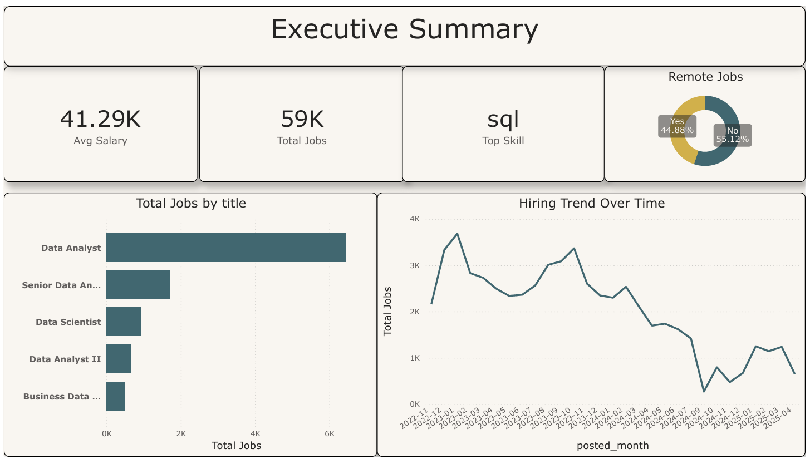
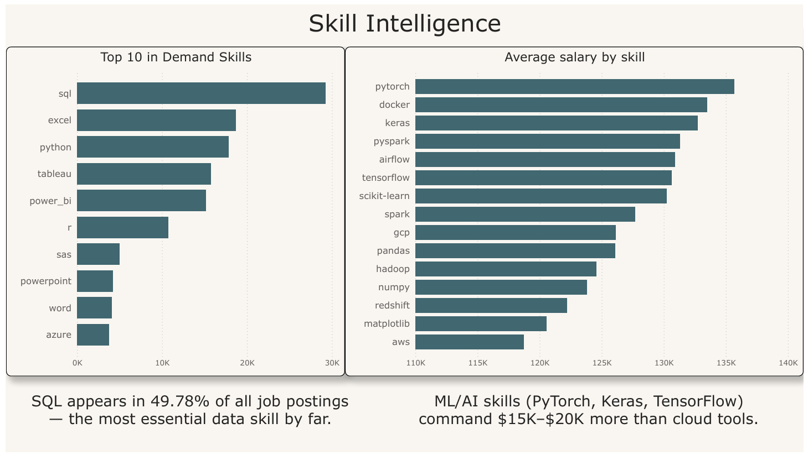

# 📊 Job Market Intelligence Dashboard

An end-to-end data analytics project analyzing **61,953 real job postings** scraped from Google Jobs to uncover which skills pay the most, which cities are hiring, and how data roles are trending over time.

**Tools Used:** Python · SQL Server · Power BI · DAX · T-SQL

---

## 📸 Dashboard Preview

### Page 1 — Executive Summary


### Page 2 — Skill Intelligence


---

## 🔍 Key Findings

| Insight | Finding |
|---|---|
| Most in-demand skill | SQL (49.78% of all job postings) |
| Highest paying skills | Keras ($122K), scikit-learn ($108K), TensorFlow ($104K) |
| Top hiring city | Oklahoma City, OK (1,424 jobs) |
| Highest paying city | Colorado Springs, CO ($114,571 avg) |
| Remote vs Onsite | Onsite $70,323 avg vs Remote $25,367 avg |
| Market peak | January 2023 (3,682 postings) |
| Top role | Data Analyst (6,443 postings) |
| Skill ranking | SQL > Excel > Python > Power BI > Tableau |

---

## 🗂️ Project Structure
job-market-intelligence/
├── brief/
│   ├── insights_brief.md
│   └── JobIntelligence.pdf
├── data/
│   ├── raw/                        # Source CSV (excluded via .gitignore)
│   └── cleaned/                    # Processed CSVs (excluded via .gitignore)
├── powerbi/
│   └── job_market_dashboard.pbix
├── python/
│   ├── clean_and_load.py           # Data cleaning + skill exploding
│   └── load_to_sql.py              # Loads data into SQL Server
├── sql/
│   ├── 01_data_cleaning.sql
│   ├── 02_exploratory_analysis.sql
│   ├── 03_skill_demand.sql
│   ├── 04_salary_analysis.sql
│   ├── 05_location_analysis.sql
│   ├── 06_role_growth_trends.sql
│   └── 07_views.sql
├── visuals/
│   ├── page1_executive_summary.png
│   └── page2_skill_intelligence.png
├── .gitignore
└── README.md

---

## ⚙️ How to Reproduce This Project

### 1. Python — Data Cleaning & Loading
```bash
pip install pandas sqlalchemy pyodbc
python python/clean_and_load.py
python python/load_to_sql.py
```
- Reads raw CSV with `dtype=str` to preserve all fields
- Cleans dates, location, salary, and work_from_home columns
- Explodes `description_tokens` into one skill per row (190,665 rows)
- Loads both tables into SQL Server via Windows Authentication

### 2. SQL — Analysis in SQL Server (SSMS)
Run scripts in order inside SSMS against the `JobMarketIntelligence` database:
01 → Data cleaning validation
02 → Exploratory analysis
03 → Skill demand ranking
04 → Salary analysis
05 → Location analysis
06 → Role growth trends
07 → Views for Power BI

### 3. Power BI — Dashboard
- Open `powerbi/job_market_dashboard.pbix`
- Update the SQL Server connection to your local instance
- Refresh data

---

## 📦 Dataset

**Source:** [Luke Barousse — Data Analyst Job Postings (Google Search)](https://www.kaggle.com/datasets/lukebarousse/data-analyst-job-postings-google-search)

- 61,953 raw rows · 27 columns
- Key fields: job title, company, location, salary, schedule type, skills (as token lists)
- After cleaning: 58,775 rows

---

## 🛠️ Tech Stack

| Layer | Tool |
|---|---|
| Data Cleaning & ETL | Python (pandas, sqlalchemy, pyodbc) |
| Database | SQL Server (T-SQL, SSMS) |
| Visualization | Power BI Desktop (DirectQuery, DAX) |
| Version Control | Git + GitHub |

---

## 👤 Author

**Akardhansharma**  
📎 [github.com/akardhansharma](https://github.com/akardhansharma)